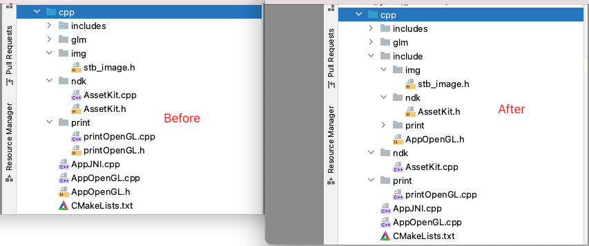

# AndroidOpenGL

## feature/cmake_target_include_directories

Adjust the project cpp directory structure to make it more organized.
* definition of `include` folder by `target_include_directories`
* move all .header file to `include` directory

preview :

