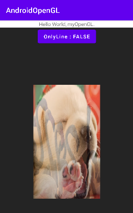

# AndroidOpenGL


## feature/openGL_rotatingCube
 2021.06.22


## feature/openGL_coordinateSystem
 2021.06.22
An object's vertices to several COORDINATE SYSTEMs before finally transforming them to NORMALIZED DEVICE COORDINATEs.

There are a total 5 different coordinate systems that are of importance to us:
* Local Space (or Object Space)
* World Space
* View Space  (or Eye Space)
* Clip Space
* Screen Space

Those are all a different state at which our vertices will be transformed in before finally ending up as fragments.

1. Local coordinates are the coordinates of your object relative to its local origin; they're the coordinates your object BEGINs in.
2. World-space coordinates are coordinates in respect of a larger world.
These coordinates are relative to some global origin of the world,  
together with many other objects also placed `relative to this world's origin`.
3. Transform the world coordinates to view-space coordinates in such a way that each coordinate is as seen from the camera or viewer's point of view.
4. Clip coordinates are processed to the -1.0 and 1.0 range and determine which vertices will end up on the screen.
5. Transform the clip coordinates to screen coordinates in a process called `viewport transform`.

The reason transforming our vertices into all these different spaces is that some operations make more sense or are easier to use in certain coordinate systems.  
For example, when modifying your object it makes most sence to do this in LOCAL SPACE,  
while calculating certain operations on the object with respect to the position of other objects makes most sense in world coordinates and so on.

vertex.vsh :  
Create a transformation matrix for each of the aforementioned steps :  
model, view and project matrix.

A vertex coordinates is then transformed to clip coordinates as follows :
````
gl_Position = projection * view * model * vPosition;
````
NOTE: the order of matrix multiplication is REVERSED.
Remember that we need to read matrix multiplication `from right to left`.

preivew :
* tilt -55 degrees along the x-axis
* a bit farther away from us along z-axis.


## feature/openGL_matrix
 2021.06.21

Import [glm](https://glm.g-truc.net/0.9.8/index.html) to Android Studio :
**First**, download OpenGL Mathematics library [here](https://glm.g-truc.net/0.9.9/index.html)
**Second**, extract and copy folder "../glm/glm" to your project location at "../app/src/main/cpp"  
**Third**, on CMakeList.txt, add the following:
````
add_subdirectory(glm)
````
**Fourth**, include glm headers to c/c++ file


The beginning of all matrix operations is derived from an identity matrix:
```
// Make sure to initialize matrix to identity matrix first :
glm::mat4 transform = glm::mat4(1.0f);
```

Rotations in 3D are specified with an angle and a `rotation axis`.
This demo, the textured rectangle is on the XY plane so we want to rotate around the `Z-axis`.
````
transform = glm::rotate(transform,
                angle,
                glm::vec3(0.0f, 0.0f, 1.0f)  // we rotate the images 90 degrees around the `Z-axis`.
            );
````

preivew :


## feature/openGL_textureCoordinateAndWrapping
 2021.06.21

* Adjust the size of the texture display area
 The components of texture coordinates are named `S`, `T`, and `R`.  
 If values of them exceeding the boundary of 0 and 1, the area displayed texture will become SMALLER!
 As you see, [SCALE_OFFSET](app/src/main/cpp/AppOpenGL.cpp#L18-L18) is equal to `1.0f`,
 a complete texture image will be added to each of the front and back directions along the coordinate axis.
 Finally, there are `a total of 3 textures` on each coordinate axis.
* Adjust the texture wrapping setting.


preview :


## feature/openGL_matrix
 2021.06.21

Import [glm](https://glm.g-truc.net/0.9.8/index.html) to Android Studio :  
**First**, download OpenGL Mathematics library [here](https://glm.g-truc.net/0.9.9/index.html)  
**Second**, extract and copy folder "../glm/glm" to your project location at "../app/src/main/cpp"  
**Third**, on CMakeList.txt, add the following:
````
add_subdirectory(glm)
````
**Fourth**, include glm headers to c/c++ file


The beginning of all matrix operations is derived from an identity matrix:
```
// Make sure to initialize matrix to identity matrix first :
glm::mat4 transform = glm::mat4(1.0f);
```

Rotations in 3D are specified with an angle and a `rotation axis`.
This demo, the textured rectangle is on the XY plane so we want to rotate around the `Z-axis`.
````
transform = glm::rotate(transform, 
                angle, 
                glm::vec3(0.0f, 0.0f, 1.0f)  // we rotate the images 90 degrees around the `Z-axis`.
            );
````

preivew :  


## feature/openGL_textureCoordinateAndWrapping
 2021.06.21

* Adjust the size of the texture display area  
 The components of texture coordinates are named `S`, `T`, and `R`.  
 If values of them exceeding the boundary of 0 and 1, the area displayed texture will become SMALLER!  
 As you see, [SCALE_OFFSET](app/src/main/cpp/AppOpenGL.cpp#L18-L18) is equal to `1.0f`,
 a complete texture image will be added to each of the front and back directions along the coordinate axis.  
 Finally, there are `a total of 3 textures` on each coordinate axis.
* Adjust the texture wrapping setting.


preview :  


## feature/openGL_mixTexture
 2021.06.21

Mixture effect of two images superimposed.

It's IMPORTANT to distinguish the difference between `texture unit` and `attribute/uniform location`.
* Attribute/Uniform location  
  The location of an attribute/uniform variable within `a program object`.
* Texture unit  
  The binding point between the texture object and the sampler uniform is the texture unit.  
  Another confusing statement is :  
  `This location of a texture is more commonly known as a texture unit.`

Code optimization:  
Implement [`loadAndCreateTexture`](app/src/main/cpp/AppOpenGL.cpp#L56-L59) to improve code encapsulation.

NOTE : Invoking `glUseProgram` to activate the shader before setting uniform!

preview :  


## feature/openGL_helloTexture
 2021.06.19

Load image from android asset folder, and apply it as texture.

[Vertices data array](app/src/main/cpp/AppOpenGL.cpp#L18-L25) :
* Add an extra `texture coordinate` vertex attribute at the end of each row.
* Notify OpenGL of the new vertex format by invoking `glVertexAttribPointer` three times.  
  2 float data to specify vertex position  
  3 float data to specify color  
  2 float data to specify texture coordinate

Texture coordinate :  
By default, the texture is flipped upside-down.  
OpenGL expects the 0.0 `texture coordinate` on the `y-axis` to be on the bottom side of the image,  
but images usually have 0.0 at the top of the `y-axis`.  
So calling `stbi_set_flip_vertically_on_load(true)` before loading any image to flip the `y-axis`.
````
For the later `develop` branch, `stbi_set_flip_vertically_on_load(true)` will be comment out by swaping the `y-axis` of texture coordinate.
````

Image Loading :
* Load image file data from `assets` folder by [ndkAsset_readBytes](app/src/main/cpp/ndk/AssetKit.h#L12-L12)
* Parse image file data to image pixel data by [stbi_load_from_memory](app/src/main/cpp/img/stb_image.h#L392-L392)
* The `width` `height` `channel` can be obtained after parsing image file.
* The `format` parameter of `glTexImage2D` is determined by `channel` value.
  If `channel` is equals to `4`, pass `GL_RGBA` to `format`; if `channel` is equals to `3`, pass `GL_RGB` to `format`.
* IMPORTANT : [`free` image file data](app/src/main/cpp/img/stb_image.h#L281-L281) and [`free` image pixel data](app/src/main/cpp/img/stb_image.h#L284-L284)


preview :  


## feature/ndk_AAssetManager
 2021.06.19  
Move the shader codes out from CPP code, then store it separately in the assets folder.  
Code **decoupling** optimization.  
Keep code more **organized**.

Shader code store in `assets` directory :
* vertex.vsh
* fragment.fsh

Usage of `AAsset_Manager`:
* Invoke `AAssetManager_fromJava(JNIEnv*, jobject assetManager)` to get `AAssetManager`,  
  and store it in the global variable `gAAssetMgr` for subsequent logic calls.
* Get `AAsset*` pointer object by calling method `AAssetManager_open` with three parameters : `AAssetManager` `assetItemName` `mode`
* Invoke `AAsset_getLength` with parameter `AAsset*` to get the data length, preparation for the next step of `new` operation.
* Read target data by invoking `AAsset_read`
* Finally, `AAsset_close` with parameter `AAseset*`.

## feature/openGL_shaderInterpolation
 2021.06.18  
Demonstrate the realization of shader interpolation.

Learning focus :
* Sending data to the graphics card from the CPU is relatively slow.  
  This demo, we add color data to the [vertex data](app/src/main/cpp/AppOpenGL.cpp#L37-L44), send them to the vertex shader at once.
* 2 float data define a position, 3 float data define a color.  
  Each row of vertex data have 5 float data.  
  So try to understand the last parameter of `glVertexAttribPointer` better,  
  that treated as a byte `offset` into the buffer object's data store.

Hint : [Shader code](app/src/main/cpp/AppOpenGL.cpp#L10-L21) end with `\0` to indicate that this is the end of a C string.

preview :  


## feature/glsl_uniform
 2021.06.18  
`uniform` usage :  
A way to pass data from our application on the CPU to the shaders on the GPU.

Learning focus :
* `uniform` variable can be assigned in GLSL code, otherwise an compilation error will be thrown. "S0027: Cannot modify a uniform variable"
* Use `glGetUniformLocation` to find the index/location of the uniform attribute in our shader when [app_initGL()](app/src/main/cpp/AppOpenGL.h#L12-L12) is executed.
* When rendering frame, use `glUniform4f` to update the value of uniform variable `myColor`.


preview :  
The color of triangles is constantly changing with the value calculated by the CPU.

## feature/glsl_in_out
 2021.06.18  
'in' 'out' variable usage :  
OpenGL will link those variables together and then it it possible to send data from vertex shader to fragment shader after linking a program object.  
In this demo, define a `purple` color (mix red and blue) in vertex shader as the input parameter of fragment vertex.


Learning focus :
* Shader Language always begin with a version declaration.
  The default version value is `version 100`.  
  Adding a `\n` as a line separator is necessary.
* Declare an output variable `out vec4 colorFromVertex` in vertex shader,
  and a similar input variable `in vec4 colorFromVertex` in fragment shader with same name and same type.
* `gl_FragColor` is deprecated.  
  The modern way of writing to the output buffers from a fragment shader,  
  is to declare user-defined output variable,  
  such as `out vec4 fragColor` in demo code.

preview :  
The color of <span style="color:purple">triangle</span> will become <span style="color:purple">purple</span>.  
<span style="color:purple"><font size="150">▲</font></span>

## feature/openGL_helloSquare_IBO
 2021.06.18  
IBO/EBO usage : drawing a square composed of two triangles.

Learning focus :
* Specify the unique [4 vertices](app/src/main/cpp/AppOpenGL.cpp#L26-L31) and the [6 indices](app/src/main/cpp/AppOpenGL.cpp#L33-L36) to define two triangle, two of them form a square.
* Create `Index Buffer Object(IBO) / Element Buffer Object(EBO)`
* Bind `IBO/EBO` with `glBindBuffer`, copy [6 indices](app/src/main/cpp/AppOpenGL.cpp#L33-L36) into the buffer with `glBufferData`, specify `GL_ELEMENT_ARRAY_BUFFER` as the buffer type.
* Replace the ~~`glDrawArrays`~~ with `glDrawElements` to indicate we want to render the triangles from an index buffer.
* Remember to delete `IBO/EBO` by invoking `glDeleteBuffers`

preview :  


## feature/openGL_helloTriangle
 2021.06.17

use VAO/VBO to draw triangle

Learning focus :
* generate VAO first then VBO, because any subsequent vertex attribute calls after `glGenVertexArrays` wil be stored inside the VAO
* bind the VAO first, then bind and set vertex buffers(s), and then configure vertex attribute(s). Finally, DON'T forget to unbind : `glBind****(0)`.
* when doing rendering, there's no need to `glUseProgram` and `glBindVertexArray` every time, BUT we'll do so JUST keep things a bit more organized.

  preview :


## feature/openGL_helloTriangle_legacy
 2021.06.17

legacy way for Triangle Drawing

Learning focus :
*  [app_initGL](app/src/main/cpp/AppOpenGL.cpp#L172-L172) :  
   1. [loadGLShader](app/src/main/cpp/AppOpenGL.cpp#L44-L44)  
       `glCreateShader`  
       `glShaderSource`  
       `glCompileShader`
   2. `glCreateProgram`
   3. `glAttachShader`
   4. `glLinkProgram`
   5. (optional) `glDeleteShader`
* [app_renderTriangle](app/src/main/cpp/AppOpenGL.cpp#L152-L152) :
  1. `glUseProgram`
  2. `glDrawArrays`
* [app_destroyGL](app/src/main/cpp/AppOpenGL.cpp#L198-L198)

The last parameter of `glVertexAttribPointer` has the type of `pointer` just for compatibility.  
In **legacy** OpenGL, specify a data pointer directly without being bound a buffer object,  
because the pointer should not be treated as a byte offset into the buffer.

preview :  


## feature/openGL_renderClearColor
 2021.06.16
Understand and practise of function `glClearColor` and `glClear`.

preview :  


## feature/print_openGL_infos
 2021.06.16  
print openGL infos by glGetString.   
Only four field values can be read :   
`GL_VERSION` `GL_VENDOR` `GL_RENDERER` `GL_EXTENSIONS`.  
And it makes sense to invoke `glGetString` after `GLSurfaceView` is initialized, otherwise it returns null.  

Both Java(see `GL3Renderer`) and C++(see `printOpenGL.cpp`) implementations are dealt with separately.  

